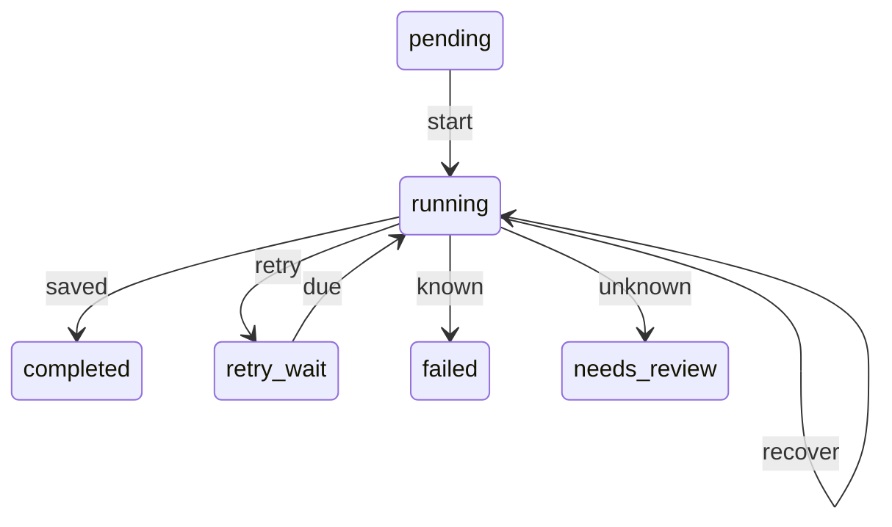

# ChargeAIAgent

A durable `charge → provision → notify` workflow engine using Python 3.12, FastAPI,
Pydantic, PostgreSQL 16, and a separate flaky HTTP mock tool.

**Scope:** crash-safe resume and safe retries. Completed steps are skipped; interrupted
requests reuse the original idempotency key so the mock side effect happens once.

## Run and demo

Requires Docker Compose v2 and free ports 5432, 8000, and 8001.

```sh
docker compose up --build -d --wait
docker compose run --rm seed
```

Or open http://localhost:8000/docs and submit `POST /runs` with `{}`.
The API returns `202 Accepted` after saving the run. Poll `GET /runs/{id}` for progress;
inspect effects at `http://localhost:8001/effects?prefix=RUN_UUID` and logs with
`docker compose logs -f worker`.

```sh
python3 scripts/demo.py
```

The demo kills the worker with SIGKILL after the charge succeeds but before its checkpoint,
restarts it, and verifies completion: **two charge attempts, one charge effect, same result ID**.
Run with no other unfinished workflows. Restore normal settings afterward:

```sh
docker compose up -d --force-recreate tool worker
```

See [DEMO.md](DEMO.md) for the recording outline; include a narrated video in the submission.
PostgreSQL data lives in a named volume: `docker compose down` preserves it;
**`docker compose down -v` deletes it**. Services use local-demo credentials and no API
authentication; this is not a production deployment.

## Execution and guarantees

One worker executes ordered steps. A PostgreSQL session advisory lock rejects a second worker;
losing its database connection is fatal. Engine, storage, HTTP client, and API layers are separate,
with synchronous SQL/HTTP throughout the worker.

Before a tool call, the engine commits `running` and increments attempts. After a validated
response, it atomically saves the result and `completed`. Final-step and run completion share
a transaction, as do run creation and its step rows.



**Due** means the persisted retry deadline has been reached. **Recover** means a replacement
worker retries an interrupted attempt with the same key. **Known/unknown** distinguish whether
an unresolved outcome remains when retrying stops.

Keys contain the run UUID, workflow version, step position, and name—never the attempt number.
Keys and inputs are persisted at creation. The mock atomically stores its simulated effect and
result under a unique key; duplicate requests return that result, while mismatched inputs are
rejected. Engine and tool use separate schemas in one PostgreSQL instance, with no shared
completion transaction.

**Requests may repeat; effects happen once only under the tool's durable idempotency contract.**
This does not make arbitrary external APIs exactly-once or guarantee eventual success.
Database loss, failover, and expired idempotency keys are outside the process-crash model.

## Retries and terminal states

- Retryable: 429, 5xx, 408, transport errors, and invalid successful responses. Other HTTP errors stop execution.
- Full-jitter exponential backoff is capped at 8 seconds; valid `Retry-After` is a lower bound
  and can exceed that cap. Deadlines and failure counts persist across restart.
- Default budget: **five recorded failures per step**, normally the initial failure plus four retries.
  Crashes increment attempts but do not consume the recorded-failure budget.
  `CHARGE_MAX_FAILURES` configures the application; Compose does not forward it from the host.
- Timeouts, interrupted attempts, and other ambiguous responses leave uncertainty until success.
  A later 429 cannot erase it.

| State | Expected behavior |
|---|---|
| `retry_wait` | Retry the same step when due; completed steps remain skipped. |
| `failed` | Terminal: retrying stopped without an unresolved outcome for the failing step. |
| `needs_review` | Terminal: retrying stopped with an unresolved outcome. **Status only:** no alert, ticket, review queue, reconciliation, or operator resume action. |
| `completed` | Terminal: no further execution. |

**There is no second retry layer:** failed runs are not revived after 30 minutes, tool recovery,
worker restart, or a larger retry budget. Later steps stay unstarted, and earlier effects are
not refunded or rolled back. Repeating `POST /runs` creates a new purchase and can charge again;
it is not a safe recovery action. Worker restart is manual in Compose (`restart: "no"`).

The mock defaults to 25% seeded failures (429/503 before the effect). Set
`CHARGE_TOOL_FAIL_FIRST=1` for one initial 429 per step or
`CHARGE_TOOL_RESPONSE_DELAY_SECONDS` to delay responses after effect commit.
Completed keys return their saved result before failure injection.

## Failure modes

| Worker dies… | Durable state | Recovery |
|---|---|---|
| Before sending the request | Step `running`, no effect | Same key creates the first effect. |
| After tool commit, before response | Effect exists; step `running` | Same key returns the saved result. |
| After response, before checkpoint | Effect exists; step `running` | Deduplicate, then checkpoint. |
| Inside checkpoint transaction | Completion writes uncommitted | PostgreSQL rolls back; replay safely. If COMMIT succeeded but its acknowledgement was lost, skip the saved completion. |
| After checkpoint commit | Step completed | Skip it; advance. Final-step/run completion is atomic. |

## Tests and development

```sh
docker compose run --build --rm test
```

Tests use real PostgreSQL and worker subprocesses in a dedicated `charge_test` database.
Coverage includes **12 SIGKILL cases** (four checkpoint boundaries × three steps), three
lost-response cases, persisted retry waits, concurrent tool deduplication, mismatched keys,
terminal errors, sticky uncertainty, API validation, and second-worker rejection.

The commit barrier is inside an open transaction **before COMMIT**; it tests rollback, not disk
tears or a precise interruption inside PostgreSQL's commit implementation. Exhaustion tests use
a one-failure budget. The separate `test/retry-exhaustion-restart` regression is not yet in this
branch; default-budget boundaries and both terminal states across restart remain follow-ups.
CI also builds images and runs the crash demo.

For local development:

```sh
python3.12 -m venv .venv
source .venv/bin/activate
pip install -r requirements.lock
pip install --no-deps -e .
docker compose up -d --wait db
pytest -q
ruff check src tests scripts
mypy src tests scripts
```

Run services in separate terminals with `uvicorn charge_agent.api:app --port 8000`,
`uvicorn charge_agent.mock_api:app --port 8001`, and `python -m charge_agent.worker`.
Tests truncate their dedicated database; never point them at real data.

## Cuts and next steps

The one-day scope prioritizes correctness at the effect/checkpoint boundary. Excluded:
concurrent workers, leases/fencing, fan-out, cancellation, tool-wide throttling, dashboard,
workflow upgrades, compensation, and production deployment. SIGTERM is checked between steps;
full bounded drain is not claimed. Only the fixed `purchase-v1` workflow is supported.

The two main tradeoffs are **single-worker throughput** and **unresolved outcomes that require
operator tooling we have not built**.

Priority order:

1. **Finish validation:** integrate the terminal-restart regression, test the default failure
   budget and `needs_review` across restart, confirm CI, and record the demo.
2. **Resolve stranded runs:** provider lookup by original key, review queue, and reliable alerts.
3. **Enable safe recovery:** authorized, audited resume preserving keys/checkpoints; define
   compensation for partial success.
4. **Prevent duplicate purchases and improve visibility:** submission idempotency, event history,
   and metrics. Consider bounded delayed recovery only after reconciliation exists.
5. **Scale when needed:** claims/leases, fencing, concurrency, graceful drain, and tool-wide throttling.

Production deployment also requires authentication, secret management, migrations, backups,
and service supervision.

## AI usage

AI helped with scoping, implementation, tests, and review. An early plan treated retry exhaustion
as ordinary failure; reviewing a committed charge with a lost response exposed the mistake.
The engine now preserves uncertainty as `needs_review`, with a regression for a subsequent 429.
Review also caught the need to wait for tool health at startup. Generated tests are not evidence
until run; the candidate should understand the transaction boundaries and provider contract.
