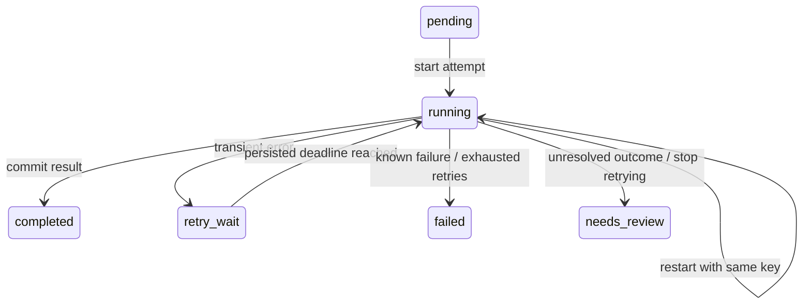

# ChargeAIAgent

A small durable execution engine for `charge → provision → notify`, built with Python 3.12,
FastAPI, Pydantic, and PostgreSQL 16. Includes a separate flaky HTTP mock tool.

**Chosen properties:** crash-safe resume and safe retries. A committed step is never called again.
An interrupted step may send another request with the **same idempotency key**. The mock tool
atomically deduplicates requests so each logical side effect happens once.

## Run

Requires Docker with Compose v2. From this directory:

```sh
docker compose up --build -d --wait
```

Open http://localhost:8000/docs and submit `POST /runs` with `{}` for the sample inputs,
or seed a run directly:

```sh
docker compose run --rm seed
```

The seed command prints a run UUID. Inspect it with `GET /runs/{id}`, and inspect the tool ledger
at `http://localhost:8001/effects?prefix=RUN_UUID`. Both APIs have interactive `/docs`.

```sh
curl -s http://localhost:8000/runs -H 'Content-Type: application/json' \
  -d '{"customer_id":"demo-customer","amount_cents":2500,"currency":"USD"}'
docker compose logs -f worker
```

Ports 5432, 8000, and 8001 must be free. PostgreSQL uses a named volume. `docker compose down`
preserves data; **`docker compose down -v` deletes it**. Credentials are local-demo defaults;
the APIs are unauthenticated and bound to localhost. Do not deploy this Compose file publicly.
Repeated `POST /runs` creates distinct purchases: API-submission deduplication is out of scope.

## Live crash demo

```sh
python3 scripts/demo.py
```

This starts the stack with random failures disabled and a deliberate barrier after the charge
response, before the engine checkpoint. It shows a committed charge while the engine step is
still running, sends real SIGKILL to the worker, restarts it, and asserts:

- The workflow completes in order.
- Charge has two attempts and exactly one durable effect with the original result ID.
- Provision and notify each have one effect.

No data is erased by the script. Run it with no other unfinished workflows to keep the demonstration
focused. The pause triggers only on the first attempt, so restart can recover with the same config.
Restore normal settings afterward: `docker compose up -d --force-recreate tool worker`.

For a manual video: start with
`CHARGE_PAUSE_AT=after_tool CHARGE_TOOL_FAILURE_RATE=0 docker compose up --build -d --wait`,
submit a run, inspect the ledger and worker logs, then execute
`docker compose kill -s SIGKILL worker` followed by `docker compose start worker`.
See [DEMO.md](DEMO.md) for a short recording outline. The submission should include a candidate-narrated video demonstrating the crash and explaining
one architectural decision.

## Tests and development

The suite uses **real PostgreSQL transactions and actual worker subprocesses**, not an in-memory
storage substitute. Tests use a separate database named `charge_test`, initialized by Compose.

```sh
docker compose run --build --rm test
```

Or use a local Python environment (including PyCharm):

```sh
python3.12 -m venv .venv
source .venv/bin/activate
pip install -r requirements.lock
pip install --no-deps -e .
docker compose up -d --wait db
pytest -q
ruff check src tests scripts
mypy src tests scripts
```

Run each service in its own terminal using `uvicorn charge_agent.api:app --port 8000`,
`uvicorn charge_agent.mock_api:app --port 8001`, and `python -m charge_agent.worker`.
Integration tests truncate only their dedicated `_test` database. Never point them at real data.
The CI workflow also builds Docker images and executes the complete crash demo.

## Execution model and correctness

**Sequential steps, one worker process.** A PostgreSQL session advisory lock rejects a second
worker. All worker storage operations use that same connection. A connection failure is fatal;
the worker never silently reconnects and continues without reacquiring ownership. This is not a
multi-worker lease/fencing design. An old HTTP request may outlive a dead worker; tool-side
idempotency protects against this overlap.

The worker selects the earliest unfinished step of an eligible run. It commits `running` and
increments the request attempt count **before** calling the tool. It commits the result and
`completed` together **after** a validated response. Final-step completion and run completion
share a transaction. Run creation and all step rows also share a transaction.



A running step after restart is an **unknown outcome**, never evidence that nothing happened.
Each key is derived from run UUID, persisted workflow version, position, and name, and stored with
immutable input at run creation. It never includes an attempt number. Completed results are read
from storage; earlier steps are not replayed. Changes to workflow definitions require a new version;
this submission only executes `purchase-v1` and does not implement upgrades of existing runs.

**External boundary:** the mock tool's ledger row is the simulated charge/provision/notification.
Its key, input, and returned result are inserted atomically under a unique constraint. Overlapping
calls converge on the original result. Reusing a key with another input or operation is rejected.
The engine cannot access this ledger to bypass the HTTP protocol. Separate schemas share one
PostgreSQL instance for setup convenience; no transaction spans engine and tool completion.

The exactly-once guarantee is for **effects**, conditional on the tool's durable idempotency
contract and retaining its keys. HTTP requests are at-least-once while retry/recovery continues.
Finite retries do not guarantee eventual completion. An arbitrary non-idempotent external API
cannot be made exactly-once by this engine; production integrations need provider idempotency
or reconciliation. Database loss, backups, replication/failover, and key expiration are outside
this process-crash failure model.

## Retry decisions

- 429, 5xx, 408, transport failures, and invalid successful responses are retryable.
- Other HTTP errors stop the run. A later step never starts after a failure.
- Full-jitter exponential backoff has an 8-second ceiling. Valid `Retry-After` seconds or dates
  are a lower bound and may exceed that ceiling. The computed deadline and failure count persist.
- Default budget: five recorded failures per step (initial failure plus at most four retries
  when each attempt returns a recorded error). `CHARGE_MAX_FAILURES` configures the application
  setting; the current Compose file does not forward this variable from the host to the worker.
  A recorded attempt interrupted by a process crash does not consume the failure budget; a
  `running` step is allowed another attempt on restart to resolve its unknown outcome.
- A timeout, interrupted attempt, invalid response, or 5xx may have produced an effect. That
  uncertainty is sticky until success: a subsequent 429 does not erase it. Exhaustion yields
  `needs_review`, not a false claim of no charge. No automatic refunds or operator retry endpoint.

The mock's default failure rate is 25%, with both 429 and 503 responses before performing the
effect. Failures are pseudorandom using a seed, key, and persisted request count. Set
`CHARGE_TOOL_FAIL_FIRST=1` to force one 429 per step. Completed keys return their saved result
before failure injection. `CHARGE_TOOL_RESPONSE_DELAY_SECONDS` delays responses after commit,
creating a genuine ambiguous-outcome window.

## Feature expectations and terminal states

The API returns `202 Accepted` when a run is saved, not when its work is complete. Poll
`GET /runs/{id}` for current status; the original POST response does not update.

| Step/run state | What the engine does automatically | What it does not do |
|---|---|---|
| `retry_wait` (step; run remains `running`) | Retries the same step once its persisted deadline is due, within the failure budget. | Does not restart earlier completed steps. |
| `running` after worker death | After a replacement worker starts, retries the unfinished step with its original key and input. | Does not itself restart the worker process; Compose uses `restart: "no"`. |
| `completed` | Skips completed steps; a completed run is no longer selected. | Does not repeat effects for that run. |
| `failed` | Records a terminal failure when retrying stops without an unresolved outcome for the failing step. Later steps remain unstarted. | Does not revive the run when the tool becomes healthy or the worker restarts. |
| `needs_review` | Records a terminal state when retrying stops with an unresolved outcome. Preserves error and attempt information for inspection. | Does not notify a person, open a ticket, publish a webhook, or start a reconciliation process. |

**`needs_review` is a status, not an implemented human-review workflow.** Inspection currently
requires querying the run API, logs, or database. There is no review queue, assignment, approval,
operator resume endpoint, or automatic resolution. Uncertainty can be conservative: even a crash
before sending a request can leave an unresolved `running` attempt.

**There is one retry layer: bounded step retries.** There is no policy such as “the workflow
reached FAILED; wait 30 minutes and revive the entire workflow automatically.” Both `failed`
and `needs_review` remain terminal under the current scheduler, regardless of elapsed time,
tool recovery, or worker restart. Increasing the failure budget does not reopen existing terminal
runs. A step's retry deadline only applies while the run remains active.

Failure does not roll back previous effects. For example, a successful charge followed by a
terminal provision failure leaves the charge in place; there is no refund or compensation logic.
Submitting the same input through `POST /runs` creates a new run with new keys and can charge
again. Creating a new run is therefore not a safe substitute for reconciling and resuming the
original one.

## Failure modes

| Death point | Durable state | Recovery and reason |
|---|---|---|
| After `running`, before sending the request | Step running, no tool effect | Retry same key; first effect is created. |
| Tool committed, worker has not received response | Tool effect exists; step running | Retry same key returns original result. No second effect. |
| Worker received success, before checkpoint | Tool effect exists; step running | Same deduplicated request, then checkpoint. |
| Between checkpoint writes inside the transaction | Uncommitted completion changes | PostgreSQL rolls back; repeat safely. If COMMIT itself succeeded but its acknowledgement was lost, read the committed state and skip. |
| After checkpoint commit, before the next step | Completed result is durable | Skip that step and proceed. Final-step/run completion are atomic. |

Current automated coverage in `tests/test_recovery.py` and `tests/test_semantics.py`:

| Scenario | Coverage |
|---|---|
| Before request, after response, inside checkpoint transaction, after checkpoint commit | Four boundaries × charge/provision/notify: 12 real SIGKILL cases. Checks ordering, skipped completed steps, attempt/request counts, and one effect per operation. |
| Tool committed, response not yet received | Three cases, one per step, using a response delay and a real worker kill. |
| Restart during retry wait | Charge; verifies the effect is not created before the saved deadline and the run finishes. |
| Duplicate tool requests and mismatched key reuse | Concurrent requests converge on one effect; changed input or operation is rejected. |
| Permanent errors and exhausted retries | Checks terminal states and blocked later steps; exhaustion tests use a one-failure budget. |
| Unknown outcome followed by 429 | Verifies the later rejection does not erase earlier uncertainty. |
| API and worker ownership | Validates run execution/input and rejection of a second worker. |

This is targeted failure coverage, not an exhaustive proof of every possible crash timing.
A separate exhausted-run restart test exists on `test/retry-exhaustion-restart`; it is not yet
part of this branch's suite. Default five-failure budget boundaries and restart behavior for
both terminal states are useful remaining regression tests.
The `during_commit` barrier is **inside the open transaction before COMMIT**, not a simulated
disk tear or a precise kill inside PostgreSQL's COMMIT implementation. PostgreSQL provides the
atomicity of the actual commit; the test demonstrates rollback of uncommitted application writes.

## Scope and tradeoffs

Built: crash-safe resume, safe retries, durable mock idempotency, basic inspection/logging,
typed API/models, reproducible failure controls, one-command startup, and failure tests.

Cut: concurrent workflow workers, leases/fencing, fan-out, cancellation, adaptive tool-wide
throttling, dashboard, workflow upgrades, auth, deployment, and compensation. The worker checks
SIGTERM between steps and can finish an in-flight request, but full bounded drain is not a claimed
feature. These cuts keep the one-day project focused on the external-effect/checkpoint boundary.

Two choices I would revisit in production:

1. **Unknown outcomes after the retry budget.** Stopping for review is safe but operationally
   incomplete. A provider lookup/reconciliation API and operator tooling would resolve these runs.
2. **Single worker and blocking I/O.** This keeps ownership and flow understandable. The worker uses
   synchronous HTTP and SQL consistently; FastAPI synchronous handlers run in its thread pool.
   Throughput, fair scheduling, pooling, and multi-worker fencing need a separate design.

`engine.py` controls execution; `storage.py` owns engine transactions; `tool_client.py` owns HTTP
classification; `tool_storage.py` owns mock deduplication; API modules validate and route requests.
The mock deliberately receives the same purchase input for each step; this is an ordered execution
example, not a general-purpose result-binding language or a real payment integration.

## Next steps, in priority order

These are proposed follow-ups, not features included in this take-home.

| Priority | Work | Why it comes next |
|---|---|---|
| 1 — Finish submission validation | Integrate the exhausted-run restart regression; test the default budget around four versus five failures and terminal `needs_review` across restart. Confirm CI and record/link the narrated demo. | Closes specific coverage and delivery gaps without expanding runtime scope. |
| 2 — Reconcile unresolved outcomes | Add provider lookup by the original operation key, a durable review queue, and reliable alerts. Surface the run, step, error, and original result when known. | A saved `needs_review` state alone can leave real customer work stranded and an external effect unresolved. |
| 3 — Controlled operator recovery | Add authenticated, authorized, audited resolution/resume actions. Preserve original keys, immutable inputs, and completed checkpoints; guard concurrent operator actions. Define compensation for partial success. | Allows recovery without duplicate charges or blindly replaying completed work. |
| 4 — Prevent duplicate submissions and expose operational health | Add client submission idempotency, durable event history, and metrics for retry volume, stuck runs, and unresolved outcomes. | Separate POST requests currently create separate purchases; operators also need to detect failures beyond terminal logs. |
| 5 — Selective delayed recovery | Only after reconciliation and controlled resume exist, consider a durable schedule for verified transient failures, with cooldowns and a total recovery budget. | Helps with long outages. It must resume eligible unfinished work safely, never blindly revive all terminal runs or unresolved effects. |
| 6 — Scale and broaden execution | Introduce per-run claims/leases, stale-worker fencing, bounded concurrency, graceful drain, and tool-wide throttling. Add fan-out/cancellation only for demonstrated product needs. | Throughput and richer workflows add ownership and side-effect complexity; establish recovery semantics first. |

For deployment beyond the local demo, authentication, secret management, database migrations,
backups, and service supervision are prerequisites rather than capabilities provided by Compose.

## AI usage

AI helped scope the project, draft the implementation, generate failure tests, and review the
recovery model. Human review should focus on every transaction boundary and the provider contract.
This repository is AI-assisted; the candidate should understand it before submitting.

An early plan treated retry exhaustion as ordinary failure. Reviewing the case where a charge
commits but the response disappears showed that this was wrong: the outcome can still be unknown.
The implementation now retains uncertainty and uses `needs_review`; tests also verify that a
later 429 cannot accidentally clear an earlier unknown outcome. Another review caught startup
ordering: the worker must wait for the tool's health check, not merely its container creation.
Use actual CI results as evidence; generated tests alone are not proof they pass.
